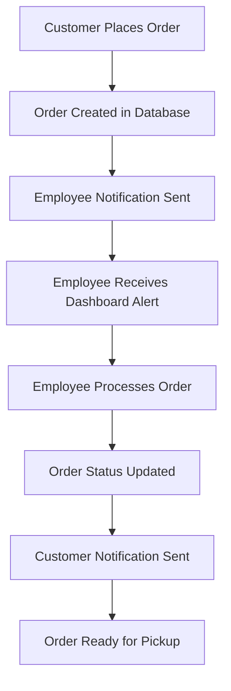

# 🛒 Order Notification System

## 🎯 **Overview**

This system provides real-time order notifications to employees, order status tracking, and customer communication for the San Pedro Beach Resort store.

## 🏗️ **System Architecture**

### **1. Order Workflow**


### **2. Notification Types**
- **Employee Notifications**: New orders, order updates, urgent orders
- **Customer Notifications**: Order confirmation, ready for pickup, order status
- **System Notifications**: Low inventory, payment issues, order conflicts

## 📋 **Database Schema**

### **1. Order Notifications Table**
```sql
-- Create order notifications table
CREATE TABLE IF NOT EXISTS order_notifications (
    id UUID DEFAULT gen_random_uuid() PRIMARY KEY,
    order_id UUID REFERENCES orders(id) ON DELETE CASCADE,
    notification_type TEXT NOT NULL CHECK (notification_type IN ('new_order', 'order_ready', 'order_cancelled', 'payment_received', 'urgent_order')),
    recipient_type TEXT NOT NULL CHECK (recipient_type IN ('employee', 'customer', 'system')),
    recipient_id UUID, -- employee_id or customer_id
    recipient_email TEXT,
    recipient_phone TEXT,
    message TEXT NOT NULL,
    status TEXT DEFAULT 'pending' CHECK (status IN ('pending', 'sent', 'delivered', 'failed')),
    delivery_method TEXT NOT NULL CHECK (delivery_method IN ('dashboard', 'email', 'sms', 'push')),
    sent_at TIMESTAMP WITH TIME ZONE,
    delivered_at TIMESTAMP WITH TIME ZONE,
    read_at TIMESTAMP WITH TIME ZONE,
    created_at TIMESTAMP WITH TIME ZONE DEFAULT NOW(),
    updated_at TIMESTAMP WITH TIME ZONE DEFAULT NOW()
);

-- Enable RLS
ALTER TABLE order_notifications ENABLE ROW LEVEL SECURITY;

-- RLS Policies
CREATE POLICY "Employees can view notifications" ON order_notifications
    FOR SELECT USING (
        recipient_type = 'employee' AND 
        EXISTS (
            SELECT 1 FROM user_profiles 
            WHERE id = auth.uid() AND user_role IN ('admin', 'manager', 'employee')
        )
    );

CREATE POLICY "Admins can view all notifications" ON order_notifications
    FOR SELECT USING (
        EXISTS (
            SELECT 1 FROM user_profiles 
            WHERE id = auth.uid() AND user_role = 'admin'
        )
    );

CREATE POLICY "System can create notifications" ON order_notifications
    FOR INSERT WITH CHECK (true);
```

### **2. Order Status Tracking Table**
```sql
-- Create order status history table
CREATE TABLE IF NOT EXISTS order_status_history (
    id UUID DEFAULT gen_random_uuid() PRIMARY KEY,
    order_id UUID REFERENCES orders(id) ON DELETE CASCADE,
    status TEXT NOT NULL CHECK (status IN ('pending', 'confirmed', 'processing', 'ready', 'picked_up', 'cancelled')),
    changed_by UUID REFERENCES user_profiles(id),
    notes TEXT,
    created_at TIMESTAMP WITH TIME ZONE DEFAULT NOW()
);

-- Enable RLS
ALTER TABLE order_status_history ENABLE ROW LEVEL SECURITY;

-- RLS Policies
CREATE POLICY "Employees can view order status" ON order_status_history
    FOR SELECT USING (
        EXISTS (
            SELECT 1 FROM user_profiles 
            WHERE id = auth.uid() AND user_role IN ('admin', 'manager', 'employee')
        )
    );
```

### **3. Update Orders Table**
```sql
-- Add notification fields to orders table
ALTER TABLE orders 
ADD COLUMN IF NOT EXISTS notification_sent BOOLEAN DEFAULT false,
ADD COLUMN IF NOT EXISTS customer_notified BOOLEAN DEFAULT false,
ADD COLUMN IF NOT EXISTS estimated_ready_time TIMESTAMP WITH TIME ZONE,
ADD COLUMN IF NOT EXISTS actual_ready_time TIMESTAMP WITH TIME ZONE;
```

## 🔧 **Implementation Components**

### **1. Notification Service**
```typescript
// lib/notification-service.ts
import { supabase } from './supabase'

export interface NotificationData {
  orderId: string
  notificationType: 'new_order' | 'order_ready' | 'order_cancelled' | 'payment_received' | 'urgent_order'
  recipientType: 'employee' | 'customer' | 'system'
  recipientId?: string
  recipientEmail?: string
  recipientPhone?: string
  message: string
  deliveryMethod: 'dashboard' | 'email' | 'sms' | 'push'
}

export class NotificationService {
  // Create notification
  static async createNotification(data: NotificationData) {
    const { data: notification, error } = await supabase
      .from('order_notifications')
      .insert({
        order_id: data.orderId,
        notification_type: data.notificationType,
        recipient_type: data.recipientType,
        recipient_id: data.recipientId,
        recipient_email: data.recipientEmail,
        recipient_phone: data.recipientPhone,
        message: data.message,
        delivery_method: data.deliveryMethod,
        status: 'pending'
      })
      .select()
      .single()

    if (error) throw error
    return notification
  }

  // Send new order notification to employees
  static async notifyNewOrder(orderId: string, orderData: any) {
    try {
      // Get all active employees
      const { data: employees } = await supabase
        .from('user_profiles')
        .select('id, email, first_name, last_name')
        .eq('is_active', true)
        .in('user_role', ['admin', 'manager', 'employee'])

      if (!employees) return

      // Create notifications for each employee
      const notifications = employees.map(employee => ({
        orderId,
        notificationType: 'new_order' as const,
        recipientType: 'employee' as const,
        recipientId: employee.id,
        recipientEmail: employee.email,
        message: `New order #${orderData.order_number} received from ${orderData.customer_name}. Total: ₱${orderData.total_amount}`,
        deliveryMethod: 'dashboard' as const
      }))

      // Send notifications
      for (const notification of notifications) {
        await this.createNotification(notification)
      }

      // Update order notification status
      await supabase
        .from('orders')
        .update({ notification_sent: true })
        .eq('id', orderId)

    } catch (error) {
      console.error('Error sending new order notification:', error)
    }
  }

  // Notify customer when order is ready
  static async notifyOrderReady(orderId: string, orderData: any) {
    try {
      await this.createNotification({
        orderId,
        notificationType: 'order_ready',
        recipientType: 'customer',
        recipientEmail: orderData.customer_email,
        recipientPhone: orderData.customer_phone,
        message: `Your order #${orderData.order_number} is ready for pickup! Please collect it at the front desk.`,
        deliveryMethod: 'email'
      })

      // Update order status
      await supabase
        .from('orders')
        .update({ 
          status: 'ready',
          actual_ready_time: new Date().toISOString(),
          customer_notified: true
        })
        .eq('id', orderId)

    } catch (error) {
      console.error('Error sending order ready notification:', error)
    }
  }

  // Get pending notifications for employee dashboard
  static async getEmployeeNotifications(employeeId: string) {
    const { data, error } = await supabase
      .from('order_notifications')
      .select(`
        *,
        orders (
          order_number,
          customer_name,
          total_amount,
          status
        )
      `)
      .eq('recipient_id', employeeId)
      .eq('status', 'pending')
      .eq('delivery_method', 'dashboard')
      .order('created_at', { ascending: false })

    if (error) throw error
    return data
  }

  // Mark notification as read
  static async markAsRead(notificationId: string) {
    const { error } = await supabase
      .from('order_notifications')
      .update({ 
        status: 'delivered',
        read_at: new Date().toISOString()
      })
      .eq('id', notificationId)

    if (error) throw error
  }
}
```

### **2. Order Processing Component**
```typescript
// components/OrderProcessing.tsx
'use client'

import { useState, useEffect } from 'react'
import { supabase } from '@/lib/supabase'
import { NotificationService } from '@/lib/notification-service'
import { 
  BellIcon, 
  ClockIcon, 
  CheckCircleIcon, 
  ExclamationTriangleIcon,
  UserIcon,
  ShoppingBagIcon
} from '@heroicons/react/24/outline'

interface Order {
  id: string
  order_number: string
  customer_name: string
  customer_email: string
  customer_phone: string
  total_amount: number
  status: string
  created_at: string
  items: OrderItem[]
}

interface OrderItem {
  id: string
  product_name: string
  quantity: number
  unit_price: number
}

export default function OrderProcessing() {
  const [orders, setOrders] = useState<Order[]>([])
  const [notifications, setNotifications] = useState<any[]>([])
  const [loading, setLoading] = useState(true)
  const [selectedOrder, setSelectedOrder] = useState<Order | null>(null)

  useEffect(() => {
    loadOrders()
    loadNotifications()
    
    // Set up real-time subscription for new orders
    const ordersSubscription = supabase
      .channel('orders')
      .on('postgres_changes', 
        { event: 'INSERT', schema: 'public', table: 'orders' },
        (payload) => {
          console.log('New order received:', payload.new)
          loadOrders()
          loadNotifications()
        }
      )
      .subscribe()

    return () => {
      supabase.removeChannel(ordersSubscription)
    }
  }, [])

  const loadOrders = async () => {
    try {
      const { data, error } = await supabase
        .from('orders')
        .select(`
          *,
          order_items (
            id,
            product_name,
            quantity,
            unit_price
          )
        `)
        .in('status', ['pending', 'confirmed', 'processing'])
        .order('created_at', { ascending: false })

      if (error) throw error
      setOrders(data || [])
    } catch (error) {
      console.error('Error loading orders:', error)
    } finally {
      setLoading(false)
    }
  }

  const loadNotifications = async () => {
    try {
      const { data: { user } } = await supabase.auth.getUser()
      if (!user) return

      const notifications = await NotificationService.getEmployeeNotifications(user.id)
      setNotifications(notifications || [])
    } catch (error) {
      console.error('Error loading notifications:', error)
    }
  }

  const updateOrderStatus = async (orderId: string, status: string, notes?: string) => {
    try {
      // Update order status
      const { error: orderError } = await supabase
        .from('orders')
        .update({ status })
        .eq('id', orderId)

      if (orderError) throw orderError

      // Add status history
      const { error: historyError } = await supabase
        .from('order_status_history')
        .insert({
          order_id: orderId,
          status,
          notes,
          changed_by: (await supabase.auth.getUser()).data.user?.id
        })

      if (historyError) throw historyError

      // If order is ready, notify customer
      if (status === 'ready') {
        const order = orders.find(o => o.id === orderId)
        if (order) {
          await NotificationService.notifyOrderReady(orderId, order)
        }
      }

      // Reload data
      loadOrders()
      loadNotifications()

    } catch (error) {
      console.error('Error updating order status:', error)
    }
  }

  const getStatusColor = (status: string) => {
    switch (status) {
      case 'pending': return 'bg-yellow-100 text-yellow-800'
      case 'confirmed': return 'bg-blue-100 text-blue-800'
      case 'processing': return 'bg-orange-100 text-orange-800'
      case 'ready': return 'bg-green-100 text-green-800'
      default: return 'bg-gray-100 text-gray-800'
    }
  }

  if (loading) {
    return (
      <div className="flex items-center justify-center h-64">
        <div className="animate-spin rounded-full h-8 w-8 border-b-2 border-green-600"></div>
      </div>
    )
  }

  return (
    <div className="space-y-6">
      {/* Notifications Panel */}
      {notifications.length > 0 && (
        <div className="bg-yellow-50 border border-yellow-200 rounded-lg p-4">
          <div className="flex items-center">
            <BellIcon className="h-5 w-5 text-yellow-600 mr-2" />
            <h3 className="text-sm font-medium text-yellow-800">
              New Notifications ({notifications.length})
            </h3>
          </div>
          <div className="mt-2 space-y-2">
            {notifications.slice(0, 3).map((notification) => (
              <div key={notification.id} className="text-sm text-yellow-700">
                {notification.message}
              </div>
            ))}
          </div>
        </div>
      )}

      {/* Orders List */}
      <div className="bg-white rounded-lg shadow">
        <div className="px-6 py-4 border-b border-gray-200">
          <h2 className="text-lg font-semibold text-gray-900">Pending Orders</h2>
          <p className="text-sm text-gray-600">Process orders and update status</p>
        </div>

        <div className="divide-y divide-gray-200">
          {orders.map((order) => (
            <div key={order.id} className="p-6">
              <div className="flex items-center justify-between">
                <div className="flex items-center space-x-4">
                  <div className="flex-shrink-0">
                    <ShoppingBagIcon className="h-8 w-8 text-green-600" />
                  </div>
                  <div>
                    <h3 className="text-lg font-medium text-gray-900">
                      Order #{order.order_number}
                    </h3>
                    <div className="flex items-center space-x-4 text-sm text-gray-600">
                      <span className="flex items-center">
                        <UserIcon className="h-4 w-4 mr-1" />
                        {order.customer_name}
                      </span>
                      <span className="flex items-center">
                        <ClockIcon className="h-4 w-4 mr-1" />
                        {new Date(order.created_at).toLocaleString()}
                      </span>
                      <span className="font-medium text-green-600">
                        ₱{order.total_amount.toLocaleString()}
                      </span>
                    </div>
                  </div>
                </div>

                <div className="flex items-center space-x-3">
                  <span className={`px-3 py-1 text-xs font-medium rounded-full ${getStatusColor(order.status)}`}>
                    {order.status}
                  </span>
                  
                  <div className="flex space-x-2">
                    {order.status === 'pending' && (
                      <button
                        onClick={() => updateOrderStatus(order.id, 'confirmed')}
                        className="px-3 py-1 text-xs font-medium text-blue-600 bg-blue-100 rounded hover:bg-blue-200"
                      >
                        Confirm
                      </button>
                    )}
                    
                    {order.status === 'confirmed' && (
                      <button
                        onClick={() => updateOrderStatus(order.id, 'processing')}
                        className="px-3 py-1 text-xs font-medium text-orange-600 bg-orange-100 rounded hover:bg-orange-200"
                      >
                        Start Processing
                      </button>
                    )}
                    
                    {order.status === 'processing' && (
                      <button
                        onClick={() => updateOrderStatus(order.id, 'ready')}
                        className="px-3 py-1 text-xs font-medium text-green-600 bg-green-100 rounded hover:bg-green-200"
                      >
                        Mark Ready
                      </button>
                    )}
                  </div>
                </div>
              </div>

              {/* Order Items */}
              <div className="mt-4">
                <h4 className="text-sm font-medium text-gray-900 mb-2">Order Items:</h4>
                <div className="grid grid-cols-1 md:grid-cols-2 gap-2">
                  {order.items?.map((item) => (
                    <div key={item.id} className="flex justify-between text-sm">
                      <span>{item.product_name} x{item.quantity}</span>
                      <span>₱{(item.unit_price * item.quantity).toLocaleString()}</span>
                    </div>
                  ))}
                </div>
              </div>
            </div>
          ))}
        </div>

        {orders.length === 0 && (
          <div className="p-6 text-center text-gray-500">
            <CheckCircleIcon className="h-12 w-12 mx-auto text-green-400 mb-4" />
            <p>No pending orders at the moment</p>
          </div>
        )}
      </div>
    </div>
  )
}
```

### **3. Employee Dashboard Integration**
```typescript
// src/app/admin/orders/page.tsx
'use client'

import { useAuth } from '@/lib/auth-context'
import { usePermissions } from '@/lib/permissions'
import ProtectedRoute from '@/components/ProtectedRoute'
import OrderProcessing from '@/components/OrderProcessing'

export default function OrdersPage() {
  const { hasPermission } = usePermissions()

  return (
    <ProtectedRoute requiredPermission="manage_orders">
      <div className="space-y-6">
        <div>
          <h1 className="text-2xl font-bold text-gray-900">Order Management</h1>
          <p className="text-gray-600">Process customer orders and manage fulfillment</p>
        </div>

        <OrderProcessing />
      </div>
    </ProtectedRoute>
  )
}
```

### **4. Real-time Notifications Hook**
```typescript
// hooks/useNotifications.ts
import { useState, useEffect } from 'react'
import { supabase } from '@/lib/supabase'
import { NotificationService } from '@/lib/notification-service'

export function useNotifications() {
  const [notifications, setNotifications] = useState<any[]>([])
  const [unreadCount, setUnreadCount] = useState(0)

  useEffect(() => {
    loadNotifications()
    
    // Set up real-time subscription
    const subscription = supabase
      .channel('notifications')
      .on('postgres_changes', 
        { event: 'INSERT', schema: 'public', table: 'order_notifications' },
        (payload) => {
          console.log('New notification:', payload.new)
          loadNotifications()
        }
      )
      .subscribe()

    return () => {
      supabase.removeChannel(subscription)
    }
  }, [])

  const loadNotifications = async () => {
    try {
      const { data: { user } } = await supabase.auth.getUser()
      if (!user) return

      const notifications = await NotificationService.getEmployeeNotifications(user.id)
      setNotifications(notifications || [])
      setUnreadCount(notifications?.filter(n => n.status === 'pending').length || 0)
    } catch (error) {
      console.error('Error loading notifications:', error)
    }
  }

  const markAsRead = async (notificationId: string) => {
    try {
      await NotificationService.markAsRead(notificationId)
      loadNotifications()
    } catch (error) {
      console.error('Error marking notification as read:', error)
    }
  }

  return { notifications, unreadCount, markAsRead, loadNotifications }
}
```

## 🚀 **Implementation Steps**

### **Step 1: Create Database Tables**
```bash
# Run the SQL to create notification tables
psql -h your_host -U your_user -d your_database -f docs/FEATURES/order_notification_system.sql
```

### **Step 2: Install Dependencies**
```bash
npm install @supabase/supabase-js
```

### **Step 3: Update Order Creation**
```typescript
// In your order creation logic, add:
await NotificationService.notifyNewOrder(orderId, orderData)
```

### **Step 4: Add to Employee Dashboard**
```typescript
// Add the OrderProcessing component to your admin dashboard
import OrderProcessing from '@/components/OrderProcessing'
```

## 📊 **Workflow Summary**

1. **Customer places order** → Order created in database
2. **System automatically notifies employees** → Dashboard notification appears
3. **Employee processes order** → Updates status (confirmed → processing → ready)
4. **Customer gets notified** → Email/SMS when order is ready
5. **Order picked up** → Status updated to completed

## 🎯 **Benefits**

- **Real-time notifications** for immediate order processing
- **Status tracking** for order visibility
- **Customer communication** for better experience
- **Employee efficiency** with clear workflow
- **Audit trail** for order history

This system ensures efficient order processing and excellent customer service!
