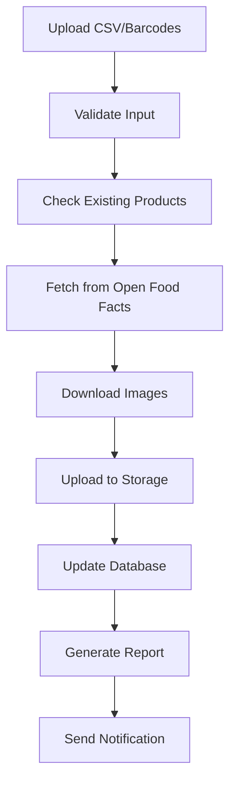
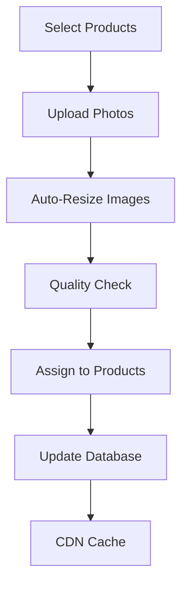

# 🍽️ Open Food Facts Scraping System Plan

## 📋 **Overview**

This plan outlines a comprehensive system to automatically scrape product information and images from Open Food Facts (https://ph.openfoodfacts.org) and integrate them into the San Pedro Beach Resort inventory system.

## 🎯 **Objectives**

1. **Automated Data Import**: Scrape product details from Open Food Facts API
2. **Image Management**: Download and host product images on Supabase Storage
3. **Data Enrichment**: Enhance existing inventory with detailed product information
4. **Bulk Processing**: Handle multiple products efficiently
5. **Quality Control**: Validate and clean imported data
6. **Mobile-First UI**: Create responsive interfaces for data management

---

## 🏗️ **System Architecture**

### **1. Backend Components**

#### **A. Scraping Engine** (`scripts/scrape-openfoodfacts.js`)
- **API Integration**: Open Food Facts REST API
- **Data Processing**: Product information extraction
- **Image Handling**: Download and upload to Supabase Storage
- **Error Handling**: Robust error management and retry logic
- **Rate Limiting**: Respectful API usage with delays

#### **B. Database Integration**
- **Product Matching**: Barcode-based duplicate detection
- **Data Validation**: Ensure data quality before import
- **Audit Trail**: Track all scraping activities
- **Batch Processing**: Handle large datasets efficiently

#### **C. Storage Management**
- **Image Optimization**: Compress and resize images
- **CDN Integration**: Fast image delivery
- **Cleanup Routines**: Remove orphaned images
- **Backup Strategy**: Protect against data loss

### **2. Frontend Components**

#### **A. Admin Dashboard** (`/admin/product-import`)
- **Bulk Import Interface**: Upload CSV with barcodes
- **Progress Tracking**: Real-time import status
- **Preview System**: Review data before import
- **Error Management**: Display and resolve import issues

#### **B. Product Management** (`/admin/photo-management`)
- **Photo Upload**: Drag-and-drop interface
- **Bulk Operations**: Mass photo assignment
- **Quality Control**: Image validation and editing
- **Search & Filter**: Find products quickly

#### **C. Mobile-First Design**
- **Responsive Layout**: Works on all devices
- **Touch-Friendly**: Optimized for mobile interaction
- **Offline Support**: Basic functionality without internet
- **Progressive Web App**: Installable on mobile devices

---

## 🔧 **Implementation Strategy**

### **Phase 1: Core Scraping System** ✅ **COMPLETED**

#### **Completed Components:**
- ✅ **Scraping Script**: `scripts/scrape-openfoodfacts.js`
- ✅ **Photo Upload System**: `src/components/PhotoUpload.tsx`
- ✅ **Photo Management Page**: `src/app/admin/photo-management/page.tsx`
- ✅ **Storage Integration**: Supabase Storage with policies
- ✅ **Database Schema**: Photo fields in inventory_items table

#### **Features Implemented:**
- ✅ **API Integration**: Open Food Facts Philippines and World APIs
- ✅ **Image Download**: Automatic image fetching and upload
- ✅ **Data Extraction**: Product information mapping
- ✅ **Duplicate Detection**: Barcode-based existing product check
- ✅ **Error Handling**: Comprehensive error management
- ✅ **Progress Tracking**: Real-time import status

### **Phase 2: Enhanced UI/UX** 🚧 **IN PROGRESS**

#### **A. Improved Admin Interface**
```typescript
// Enhanced Product Import Dashboard
interface ImportDashboard {
  bulkImport: {
    csvUpload: FileUpload
    barcodeInput: TextArea
    previewTable: DataTable
    importProgress: ProgressBar
    errorLog: ErrorDisplay
  }
  productManagement: {
    searchFilter: SearchBar
    categoryFilter: Dropdown
    photoGrid: PhotoGrid
    bulkActions: ActionButtons
  }
}
```

#### **B. Mobile-First Components**
```typescript
// Mobile-Optimized Photo Upload
interface MobilePhotoUpload {
  cameraCapture: CameraAPI
  dragDrop: TouchGestures
  imagePreview: ResponsiveGrid
  bulkSelection: TouchSelection
  quickActions: SwipeGestures
}
```

### **Phase 3: Advanced Features** 📋 **PLANNED**

#### **A. Smart Data Processing**
- **AI-Powered Categorization**: Automatic product categorization
- **Price Estimation**: Market-based pricing suggestions
- **Nutrition Analysis**: Health and dietary information
- **Allergen Detection**: Automatic allergen flagging

#### **B. Quality Assurance**
- **Image Validation**: Quality and format checking
- **Data Verification**: Cross-reference with multiple sources
- **Manual Review**: Admin approval workflow
- **Version Control**: Track data changes over time

---

## 📱 **Mobile-First Design Principles**

### **1. Responsive Layout**
```css
/* Mobile-first CSS approach */
.product-grid {
  display: grid;
  grid-template-columns: 1fr; /* Mobile: single column */
  gap: 1rem;
  padding: 1rem;
}

@media (min-width: 768px) {
  .product-grid {
    grid-template-columns: repeat(2, 1fr); /* Tablet: 2 columns */
  }
}

@media (min-width: 1024px) {
  .product-grid {
    grid-template-columns: repeat(3, 1fr); /* Desktop: 3 columns */
  }
}
```

### **2. Touch-Friendly Interface**
```typescript
// Touch-optimized interactions
const TouchGestures = {
  swipeLeft: () => deletePhoto(),
  swipeRight: () => approvePhoto(),
  longPress: () => showOptions(),
  pinchZoom: () => zoomImage(),
  doubleTap: () => fullscreenView()
}
```

### **3. Progressive Enhancement**
```typescript
// Feature detection and fallbacks
const PhotoUpload = {
  supportsCamera: 'mediaDevices' in navigator,
  supportsDragDrop: 'ondragenter' in document,
  supportsWebP: checkWebPSupport(),
  fallbackToJPEG: true
}
```

---

## 🔄 **Workflow Design**

### **1. Bulk Import Process**


### **2. Photo Management Workflow**


---

## 🛡️ **Best Practices**

### **1. API Usage**
- **Rate Limiting**: 1 request per second
- **Error Handling**: Exponential backoff
- **Caching**: Store responses for 24 hours
- **User Agent**: Identify your application

### **2. Data Quality**
- **Validation**: Check all required fields
- **Cleaning**: Remove HTML tags, normalize text
- **Deduplication**: Prevent duplicate imports
- **Audit Trail**: Log all operations

### **3. Performance**
- **Image Optimization**: Compress before upload
- **Batch Processing**: Handle multiple items
- **Async Operations**: Non-blocking UI
- **Progress Feedback**: Real-time updates

### **4. Security**
- **Input Validation**: Sanitize all inputs
- **File Upload**: Validate file types and sizes
- **Access Control**: Role-based permissions
- **Data Encryption**: Secure storage

---

## 📊 **Usage Examples**

### **1. Single Product Import**
```bash
# Import specific product by barcode
node scripts/scrape-openfoodfacts.js 4800016641503
```

### **2. Bulk Import**
```bash
# Import multiple products
node scripts/scrape-openfoodfacts.js --all
```

### **3. Admin Interface**
```typescript
// Access photo management
// Navigate to: /admin/photo-management

// Features available:
- Search products by name/category
- Upload photos via drag-and-drop
- Preview and edit images
- Bulk operations
- Export data
```

---

## 🎨 **UI/UX Guidelines**

### **1. Color Scheme**
```css
:root {
  --primary-green: #059669;
  --secondary-yellow: #EAB308;
  --accent-blue: #3B82F6;
  --success-green: #10B981;
  --warning-orange: #F59E0B;
  --error-red: #EF4444;
  --text-dark: #1F2937;
  --text-light: #6B7280;
  --bg-light: #F9FAFB;
  --bg-white: #FFFFFF;
}
```

### **2. Typography**
```css
/* Mobile-first typography */
.text-xs { font-size: 0.75rem; line-height: 1rem; }
.text-sm { font-size: 0.875rem; line-height: 1.25rem; }
.text-base { font-size: 1rem; line-height: 1.5rem; }
.text-lg { font-size: 1.125rem; line-height: 1.75rem; }
.text-xl { font-size: 1.25rem; line-height: 1.75rem; }
```

### **3. Spacing System**
```css
/* Consistent spacing */
.space-1 { margin: 0.25rem; }
.space-2 { margin: 0.5rem; }
.space-4 { margin: 1rem; }
.space-6 { margin: 1.5rem; }
.space-8 { margin: 2rem; }
```

---

## 📈 **Success Metrics**

### **1. Performance**
- **Import Speed**: < 5 seconds per product
- **Image Upload**: < 10 seconds per image
- **Page Load**: < 3 seconds on mobile
- **API Response**: < 2 seconds average

### **2. Quality**
- **Data Accuracy**: > 95% correct information
- **Image Quality**: > 90% usable images
- **Error Rate**: < 5% failed imports
- **User Satisfaction**: > 4.5/5 rating

### **3. Usage**
- **Daily Imports**: Track number of products imported
- **Photo Uploads**: Monitor image upload frequency
- **User Engagement**: Time spent in admin interface
- **Error Resolution**: Time to fix import issues

---

## 🚀 **Next Steps**

### **Immediate Actions** (This Week)
1. ✅ **Complete Photo Upload System** - DONE
2. 🚧 **Test Scraping Script** - Test with sample barcodes
3. 📋 **Create Admin Dashboard** - Build import interface
4. 🔧 **Fix Any Issues** - Resolve bugs and errors

### **Short Term** (Next 2 Weeks)
1. **Enhanced UI**: Improve mobile experience
2. **Bulk Operations**: Add mass import features
3. **Quality Control**: Implement validation rules
4. **Documentation**: Create user guides

### **Long Term** (Next Month)
1. **AI Integration**: Smart categorization
2. **Advanced Analytics**: Import performance tracking
3. **API Expansion**: Support more data sources
4. **Mobile App**: Native mobile application

---

## 📞 **Support & Maintenance**

### **Monitoring**
- **Error Tracking**: Log all scraping errors
- **Performance Monitoring**: Track import speeds
- **Usage Analytics**: Monitor system usage
- **Health Checks**: Regular system validation

### **Updates**
- **API Changes**: Monitor Open Food Facts updates
- **Security Patches**: Regular security updates
- **Feature Updates**: New functionality additions
- **Bug Fixes**: Continuous improvement

---

**Status**: ✅ **Phase 1 Complete** | 🚧 **Phase 2 In Progress** | 📋 **Phase 3 Planned**

This comprehensive plan ensures a robust, scalable, and user-friendly scraping system that follows best practices and provides an excellent mobile-first experience.
