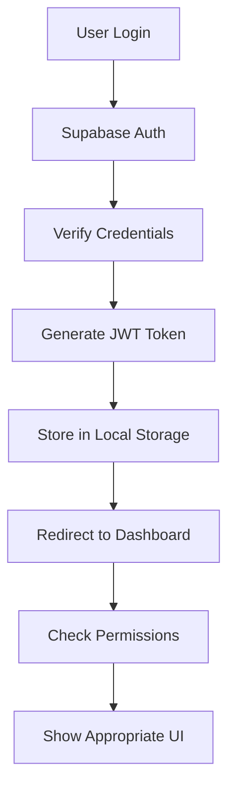

# 🔐 Authentication Setup Guide

## 🎯 **Overview**

This guide outlines the recommended authentication system using Supabase Auth with role-based access control (RBAC) for the San Pedro Beach Resort management system.

## 🏗️ **Architecture**

### **1. Authentication Flow**


### **2. Role-Based Access Control**
```typescript
// User roles and their capabilities
interface UserRole {
  id: string;
  name: string;
  permissions: string[];
  dashboard_access: string[];
  can_manage_users: boolean;
  can_manage_inventory: boolean;
  can_manage_bookings: boolean;
  can_view_reports: boolean;
  can_process_payments: boolean;
}
```

## 📋 **Implementation Steps**

### **Step 1: Database Schema Setup**

#### **A. User Profiles Table**
```sql
-- Enhanced user_profiles table
CREATE TABLE IF NOT EXISTS user_profiles (
    id UUID REFERENCES auth.users(id) PRIMARY KEY,
    username TEXT UNIQUE NOT NULL,
    first_name TEXT NOT NULL,
    last_name TEXT NOT NULL,
    email TEXT UNIQUE NOT NULL,
    phone TEXT,
    user_role TEXT NOT NULL DEFAULT 'employee' CHECK (user_role IN ('admin', 'manager', 'employee', 'guest')),
    employee_id TEXT UNIQUE,
    department TEXT,
    position TEXT,
    hire_date DATE,
    is_active BOOLEAN DEFAULT true,
    last_login TIMESTAMP WITH TIME ZONE,
    created_at TIMESTAMP WITH TIME ZONE DEFAULT NOW(),
    updated_at TIMESTAMP WITH TIME ZONE DEFAULT NOW()
);

-- Enable RLS
ALTER TABLE user_profiles ENABLE ROW LEVEL SECURITY;

-- RLS Policies
CREATE POLICY "Users can view own profile" ON user_profiles
    FOR SELECT USING (auth.uid() = id);

CREATE POLICY "Admins can view all profiles" ON user_profiles
    FOR SELECT USING (
        EXISTS (
            SELECT 1 FROM user_profiles 
            WHERE id = auth.uid() AND user_role = 'admin'
        )
    );

CREATE POLICY "Users can update own profile" ON user_profiles
    FOR UPDATE USING (auth.uid() = id);

CREATE POLICY "Admins can manage all profiles" ON user_profiles
    FOR ALL USING (
        EXISTS (
            SELECT 1 FROM user_profiles 
            WHERE id = auth.uid() AND user_role = 'admin'
        )
    );
```

#### **B. User Sessions Table**
```sql
-- Track user sessions and activity
CREATE TABLE IF NOT EXISTS user_sessions (
    id UUID DEFAULT gen_random_uuid() PRIMARY KEY,
    user_id UUID REFERENCES user_profiles(id) ON DELETE CASCADE,
    session_token TEXT NOT NULL,
    ip_address INET,
    user_agent TEXT,
    login_time TIMESTAMP WITH TIME ZONE DEFAULT NOW(),
    logout_time TIMESTAMP WITH TIME ZONE,
    is_active BOOLEAN DEFAULT true,
    created_at TIMESTAMP WITH TIME ZONE DEFAULT NOW()
);

-- Enable RLS
ALTER TABLE user_sessions ENABLE ROW LEVEL SECURITY;

-- RLS Policies
CREATE POLICY "Users can view own sessions" ON user_sessions
    FOR SELECT USING (auth.uid() = user_id);

CREATE POLICY "Admins can view all sessions" ON user_sessions
    FOR SELECT USING (
        EXISTS (
            SELECT 1 FROM user_profiles 
            WHERE id = auth.uid() AND user_role = 'admin'
        )
    );
```

#### **C. Permission Logs Table**
```sql
-- Audit trail for user actions
CREATE TABLE IF NOT EXISTS permission_logs (
    id UUID DEFAULT gen_random_uuid() PRIMARY KEY,
    user_id UUID REFERENCES user_profiles(id),
    action TEXT NOT NULL,
    resource TEXT NOT NULL,
    resource_id UUID,
    details JSONB,
    ip_address INET,
    user_agent TEXT,
    created_at TIMESTAMP WITH TIME ZONE DEFAULT NOW()
);

-- Enable RLS
ALTER TABLE permission_logs ENABLE ROW LEVEL SECURITY;

-- RLS Policies
CREATE POLICY "Users can view own logs" ON permission_logs
    FOR SELECT USING (auth.uid() = user_id);

CREATE POLICY "Admins can view all logs" ON permission_logs
    FOR SELECT USING (
        EXISTS (
            SELECT 1 FROM user_profiles 
            WHERE id = auth.uid() AND user_role = 'admin'
        )
    );
```

### **Step 2: Supabase Configuration**

#### **A. Environment Variables**
```bash
# .env.local
NEXT_PUBLIC_SUPABASE_URL=your_supabase_url
NEXT_PUBLIC_SUPABASE_ANON_KEY=your_anon_key
SUPABASE_SERVICE_ROLE_KEY=your_service_role_key
```

#### **B. Supabase Client Setup**
```typescript
// lib/supabase.ts
import { createClient } from '@supabase/supabase-js'

const supabaseUrl = process.env.NEXT_PUBLIC_SUPABASE_URL!
const supabaseAnonKey = process.env.NEXT_PUBLIC_SUPABASE_ANON_KEY!

export const supabase = createClient(supabaseUrl, supabaseAnonKey, {
  auth: {
    autoRefreshToken: true,
    persistSession: true,
    detectSessionInUrl: true
  }
})
```

### **Step 3: Authentication Hooks**

#### **A. Auth Context**
```typescript
// lib/auth-context.tsx
import { createContext, useContext, useEffect, useState } from 'react'
import { User, Session } from '@supabase/supabase-js'
import { supabase } from './supabase'

interface AuthContextType {
  user: User | null
  session: Session | null
  userProfile: any | null
  loading: boolean
  signIn: (email: string, password: string) => Promise<any>
  signOut: () => Promise<void>
  signUp: (email: string, password: string, userData: any) => Promise<any>
}

const AuthContext = createContext<AuthContextType | undefined>(undefined)

export function AuthProvider({ children }: { children: React.ReactNode }) {
  const [user, setUser] = useState<User | null>(null)
  const [session, setSession] = useState<Session | null>(null)
  const [userProfile, setUserProfile] = useState<any | null>(null)
  const [loading, setLoading] = useState(true)

  useEffect(() => {
    // Get initial session
    supabase.auth.getSession().then(({ data: { session } }) => {
      setSession(session)
      setUser(session?.user ?? null)
      if (session?.user) {
        fetchUserProfile(session.user.id)
      }
    })

    // Listen for auth changes
    const { data: { subscription } } = supabase.auth.onAuthStateChange(
      async (event, session) => {
        setSession(session)
        setUser(session?.user ?? null)
        if (session?.user) {
          await fetchUserProfile(session.user.id)
        } else {
          setUserProfile(null)
        }
        setLoading(false)
      }
    )

    return () => subscription.unsubscribe()
  }, [])

  const fetchUserProfile = async (userId: string) => {
    try {
      const { data, error } = await supabase
        .from('user_profiles')
        .select('*')
        .eq('id', userId)
        .single()

      if (error) throw error
      setUserProfile(data)
    } catch (error) {
      console.error('Error fetching user profile:', error)
    }
  }

  const signIn = async (email: string, password: string) => {
    const { data, error } = await supabase.auth.signInWithPassword({
      email,
      password
    })
    return { data, error }
  }

  const signOut = async () => {
    await supabase.auth.signOut()
  }

  const signUp = async (email: string, password: string, userData: any) => {
    const { data, error } = await supabase.auth.signUp({
      email,
      password,
      options: {
        data: userData
      }
    })
    return { data, error }
  }

  return (
    <AuthContext.Provider value={{
      user,
      session,
      userProfile,
      loading,
      signIn,
      signOut,
      signUp
    }}>
      {children}
    </AuthContext.Provider>
  )
}

export const useAuth = () => {
  const context = useContext(AuthContext)
  if (context === undefined) {
    throw new Error('useAuth must be used within an AuthProvider')
  }
  return context
}
```

#### **B. Permission Hooks**
```typescript
// lib/permissions.ts
import { useAuth } from './auth-context'

export const usePermissions = () => {
  const { userProfile } = useAuth()

  const hasPermission = (permission: string): boolean => {
    if (!userProfile) return false

    const rolePermissions = {
      admin: [
        'manage_users',
        'manage_inventory',
        'manage_bookings',
        'view_reports',
        'manage_settings',
        'manage_payments',
        'view_analytics'
      ],
      manager: [
        'manage_inventory',
        'manage_bookings',
        'view_reports',
        'manage_payments',
        'view_analytics'
      ],
      employee: [
        'view_inventory',
        'process_bookings',
        'process_payments',
        'view_reports'
      ],
      guest: [
        'view_public_content',
        'make_bookings'
      ]
    }

    return rolePermissions[userProfile.user_role as keyof typeof rolePermissions]?.includes(permission) || false
  }

  const canAccess = (route: string): boolean => {
    const routePermissions = {
      '/admin/dashboard': ['admin', 'manager', 'employee'],
      '/admin/users': ['admin'],
      '/admin/inventory': ['admin', 'manager', 'employee'],
      '/admin/bookings': ['admin', 'manager', 'employee'],
      '/admin/reports': ['admin', 'manager'],
      '/admin/settings': ['admin'],
      '/admin/payments': ['admin', 'manager', 'employee']
    }

    const allowedRoles = routePermissions[route as keyof typeof routePermissions] || []
    return allowedRoles.includes(userProfile?.user_role)
  }

  return { hasPermission, canAccess, userRole: userProfile?.user_role }
}
```

### **Step 4: Updated Login Page**

#### **A. Modern Login Component**
```typescript
// src/app/login/page.tsx
'use client'

import { useState } from 'react'
import { useRouter } from 'next/navigation'
import Link from 'next/link'
import { useAuth } from '@/lib/auth-context'
import { EyeIcon, EyeSlashIcon, ArrowLeftIcon } from '@heroicons/react/24/outline'

export default function LoginPage() {
  const [email, setEmail] = useState('')
  const [password, setPassword] = useState('')
  const [showPassword, setShowPassword] = useState(false)
  const [loading, setLoading] = useState(false)
  const [error, setError] = useState('')
  const router = useRouter()
  const { signIn } = useAuth()

  const handleSubmit = async (e: React.FormEvent) => {
    e.preventDefault()
    setLoading(true)
    setError('')

    try {
      const { error } = await signIn(email, password)
      
      if (error) {
        setError(error.message)
      } else {
        router.push('/admin/dashboard')
      }
    } catch (err) {
      setError('An unexpected error occurred')
    } finally {
      setLoading(false)
    }
  }

  return (
    <div className="min-h-screen bg-gray-50">
      {/* Navigation Header */}
      <header className="bg-white shadow-sm border-b border-gray-200">
        <div className="max-w-7xl mx-auto px-4 sm:px-6 lg:px-8">
          <div className="flex justify-between items-center py-4">
            <div className="flex items-center">
              <div className="flex-shrink-0">
                <h1 className="text-xl md:text-2xl font-bold text-gray-900">
                  San Pedro Beach Resort
                </h1>
                <p className="text-sm text-gray-600">Staff Portal</p>
              </div>
            </div>
            
            <div className="flex items-center space-x-4">
              <Link
                href="/"
                className="flex items-center text-gray-600 hover:text-green-600 transition-colors"
              >
                <ArrowLeftIcon className="h-5 w-5 mr-2" />
                Back to Home
              </Link>
            </div>
          </div>
        </div>
      </header>

      {/* Login Form */}
      <div className="flex items-center justify-center py-12 px-4 sm:px-6 lg:px-8">
        <div className="max-w-md w-full space-y-8">
          <div>
            <div className="mx-auto h-16 w-16 bg-green-600 rounded-full flex items-center justify-center shadow-lg">
              <svg className="h-8 w-8 text-white" fill="none" stroke="currentColor" viewBox="0 0 24 24">
                <path strokeLinecap="round" strokeLinejoin="round" strokeWidth={2} d="M19 21V5a2 2 0 00-2-2H7a2 2 0 00-2 2v16m14 0h2m-2 0h-5m-9 0H3m2 0h5M9 7h1m-1 4h1m4-4h1m-1 4h1m-5 10v-5a1 1 0 011-1h2a1 1 0 011 1v5m-4 0h4" />
              </svg>
            </div>
            <h2 className="mt-6 text-center text-3xl font-extrabold text-gray-900">
              Staff Login
            </h2>
            <p className="mt-2 text-center text-sm text-gray-600">
              Sign in to access the management system
            </p>
          </div>
          
          <div className="bg-white rounded-lg shadow-lg p-8 border border-gray-200">
            <form className="space-y-6" onSubmit={handleSubmit}>
              <div className="space-y-4">
                <div>
                  <label htmlFor="email" className="block text-sm font-medium text-gray-700 mb-1">
                    Email Address
                  </label>
                  <input
                    id="email"
                    name="email"
                    type="email"
                    required
                    className="w-full px-3 py-2 border border-gray-300 rounded-lg focus:outline-none focus:ring-2 focus:ring-green-500 focus:border-transparent"
                    placeholder="Enter your email"
                    value={email}
                    onChange={(e) => setEmail(e.target.value)}
                  />
                </div>
                <div className="relative">
                  <label htmlFor="password" className="block text-sm font-medium text-gray-700 mb-1">
                    Password
                  </label>
                  <input
                    id="password"
                    name="password"
                    type={showPassword ? 'text' : 'password'}
                    required
                    className="w-full px-3 py-2 border border-gray-300 rounded-lg focus:outline-none focus:ring-2 focus:ring-green-500 focus:border-transparent pr-10"
                    placeholder="Enter your password"
                    value={password}
                    onChange={(e) => setPassword(e.target.value)}
                  />
                  <button
                    type="button"
                    className="absolute inset-y-0 right-0 pr-3 flex items-center top-6"
                    onClick={() => setShowPassword(!showPassword)}
                  >
                    {showPassword ? (
                      <EyeSlashIcon className="h-5 w-5 text-gray-400 hover:text-gray-600" />
                    ) : (
                      <EyeIcon className="h-5 w-5 text-gray-400 hover:text-gray-600" />
                    )}
                  </button>
                </div>
              </div>

              {error && (
                <div className="rounded-lg bg-red-50 border border-red-200 p-4">
                  <div className="flex">
                    <div className="ml-3">
                      <h3 className="text-sm font-medium text-red-800">
                        {error}
                      </h3>
                    </div>
                  </div>
                </div>
              )}

              <div>
                <button
                  type="submit"
                  disabled={loading}
                  className="w-full flex justify-center py-3 px-4 border border-transparent rounded-lg shadow-sm text-sm font-medium text-white bg-green-600 hover:bg-green-700 focus:outline-none focus:ring-2 focus:ring-offset-2 focus:ring-green-500 disabled:opacity-50 disabled:cursor-not-allowed transition-colors"
                >
                  {loading ? (
                    <div className="animate-spin rounded-full h-5 w-5 border-b-2 border-white"></div>
                  ) : (
                    'Sign In'
                  )}
                </button>
              </div>

              <div className="flex items-center justify-center">
                <div className="text-sm">
                  <Link href="/forgot-password" className="font-medium text-green-600 hover:text-green-500 transition-colors">
                    Forgot your password?
                  </Link>
                </div>
              </div>
            </form>

            <div className="mt-6">
              <div className="relative">
                <div className="absolute inset-0 flex items-center">
                  <div className="w-full border-t border-gray-300" />
                </div>
                <div className="relative flex justify-center text-sm">
                  <span className="px-2 bg-white text-gray-500">
                    Demo Accounts
                  </span>
                </div>
              </div>
              <div className="mt-4 text-xs text-gray-600 text-center space-y-1">
                <p><strong>Admin:</strong> admin@spbr.com / password123</p>
                <p><strong>Manager:</strong> manager@spbr.com / password123</p>
                <p><strong>Employee:</strong> employee@spbr.com / password123</p>
              </div>
            </div>
          </div>
        </div>
      </div>

      {/* Footer */}
      <footer className="bg-white border-t border-gray-200 mt-auto">
        <div className="max-w-7xl mx-auto px-4 sm:px-6 lg:px-8 py-8">
          <div className="grid grid-cols-1 md:grid-cols-3 gap-8">
            <div>
              <h4 className="text-lg font-semibold mb-4 text-gray-900">San Pedro Beach Resort</h4>
              <p className="text-gray-600 text-sm">
                Professional resort management system for staff and administrators.
                Secure access to booking, inventory, and financial management tools.
              </p>
            </div>
            
            <div>
              <h4 className="text-lg font-semibold mb-4 text-gray-900">Quick Links</h4>
              <ul className="space-y-2 text-sm text-gray-600">
                <li>
                  <Link href="/" className="hover:text-green-600 transition-colors">
                    Homepage
                  </Link>
                </li>
                <li>
                  <Link href="/forgot-password" className="hover:text-green-600 transition-colors">
                    Reset Password
                  </Link>
                </li>
                <li>
                  <span className="text-gray-500">Staff Portal</span>
                </li>
              </ul>
            </div>
            
            <div>
              <h4 className="text-lg font-semibold mb-4 text-gray-900">Support</h4>
              <div className="space-y-2 text-sm text-gray-600">
                <p>For technical support, contact your system administrator.</p>
                <p>Location: Opal, Philippines</p>
                <p>System Version: 1.0.0</p>
              </div>
            </div>
          </div>
          
          <div className="border-t border-gray-200 mt-8 pt-8 text-center">
            <p className="text-gray-500 text-sm">
              © 2024 San Pedro Beach Resort. All rights reserved.
            </p>
          </div>
        </div>
      </footer>
    </div>
  )
}
```

### **Step 5: Protected Route Component**

#### **A. Route Protection**
```typescript
// components/ProtectedRoute.tsx
import { useAuth } from '@/lib/auth-context'
import { usePermissions } from '@/lib/permissions'
import { useRouter } from 'next/navigation'
import { useEffect } from 'react'

interface ProtectedRouteProps {
  children: React.ReactNode
  requiredPermission?: string
  requiredRole?: string
}

export default function ProtectedRoute({ 
  children, 
  requiredPermission, 
  requiredRole 
}: ProtectedRouteProps) {
  const { user, loading } = useAuth()
  const { hasPermission, userRole } = usePermissions()
  const router = useRouter()

  useEffect(() => {
    if (!loading) {
      if (!user) {
        router.push('/login')
        return
      }

      if (requiredPermission && !hasPermission(requiredPermission)) {
        router.push('/admin/unauthorized')
        return
      }

      if (requiredRole && userRole !== requiredRole) {
        router.push('/admin/unauthorized')
        return
      }
    }
  }, [user, loading, requiredPermission, requiredRole, hasPermission, userRole, router])

  if (loading) {
    return (
      <div className="min-h-screen bg-gray-50 flex items-center justify-center">
        <div className="animate-spin rounded-full h-12 w-12 border-b-2 border-green-600"></div>
      </div>
    )
  }

  if (!user) {
    return null
  }

  return <>{children}</>
}
```

### **Step 6: Dashboard Layout with Role-Based Navigation**

#### **A. Admin Dashboard Layout**
```typescript
// components/AdminLayout.tsx
import { useAuth } from '@/lib/auth-context'
import { usePermissions } from '@/lib/permissions'
import { signOut } from '@/lib/supabase'
import Link from 'next/link'

export default function AdminLayout({ children }: { children: React.ReactNode }) {
  const { userProfile } = useAuth()
  const { hasPermission, userRole } = usePermissions()

  const navigationItems = [
    {
      name: 'Dashboard',
      href: '/admin/dashboard',
      icon: 'HomeIcon',
      permission: null
    },
    {
      name: 'Users',
      href: '/admin/users',
      icon: 'UsersIcon',
      permission: 'manage_users'
    },
    {
      name: 'Inventory',
      href: '/admin/inventory',
      icon: 'CubeIcon',
      permission: 'manage_inventory'
    },
    {
      name: 'Bookings',
      href: '/admin/bookings',
      icon: 'CalendarIcon',
      permission: 'manage_bookings'
    },
    {
      name: 'Reports',
      href: '/admin/reports',
      icon: 'ChartBarIcon',
      permission: 'view_reports'
    },
    {
      name: 'Settings',
      href: '/admin/settings',
      icon: 'CogIcon',
      permission: 'manage_settings'
    }
  ].filter(item => !item.permission || hasPermission(item.permission))

  return (
    <div className="min-h-screen bg-gray-50">
      {/* Header */}
      <header className="bg-white shadow-sm border-b border-gray-200">
        <div className="max-w-7xl mx-auto px-4 sm:px-6 lg:px-8">
          <div className="flex justify-between items-center py-4">
            <div className="flex items-center">
              <h1 className="text-xl font-semibold text-gray-900">
                Admin Dashboard
              </h1>
              <span className="ml-2 px-2 py-1 text-xs font-medium bg-green-100 text-green-800 rounded-full">
                {userRole}
              </span>
            </div>
            
            <div className="flex items-center space-x-4">
              <span className="text-sm text-gray-600">
                Welcome, {userProfile?.first_name} {userProfile?.last_name}
              </span>
              <button
                onClick={() => signOut()}
                className="text-sm text-gray-600 hover:text-red-600 transition-colors"
              >
                Sign Out
              </button>
            </div>
          </div>
        </div>
      </header>

      <div className="flex">
        {/* Sidebar */}
        <nav className="w-64 bg-white shadow-sm min-h-screen">
          <div className="p-4">
            <ul className="space-y-2">
              {navigationItems.map((item) => (
                <li key={item.name}>
                  <Link
                    href={item.href}
                    className="flex items-center px-4 py-2 text-sm font-medium text-gray-700 rounded-lg hover:bg-gray-100 transition-colors"
                  >
                    {item.name}
                  </Link>
                </li>
              ))}
            </ul>
          </div>
        </nav>

        {/* Main Content */}
        <main className="flex-1 p-8">
          {children}
        </main>
      </div>
    </div>
  )
}
```

## 🚀 **Migration Steps**

### **Step 1: Install Dependencies**
```bash
npm install @supabase/supabase-js @supabase/auth-helpers-nextjs
```

### **Step 2: Update Environment Variables**
```bash
# Add to .env.local
NEXT_PUBLIC_SUPABASE_URL=your_supabase_url
NEXT_PUBLIC_SUPABASE_ANON_KEY=your_anon_key
SUPABASE_SERVICE_ROLE_KEY=your_service_role_key
```

### **Step 3: Run Database Migrations**
```bash
# Execute the authentication setup SQL
psql -h your_host -U your_user -d your_database -f docs/SETUP/authentication_setup.sql
```

### **Step 4: Create Demo Users**
```sql
-- Insert demo users (run this after setting up Supabase Auth)
INSERT INTO user_profiles (id, username, first_name, last_name, email, user_role, employee_id, department, position)
VALUES 
  ('admin-user-id', 'admin', 'Raymond', 'Admin', 'admin@spbr.com', 'admin', 'EMP001', 'Management', 'System Administrator'),
  ('manager-user-id', 'manager', 'Jingjing', 'Manager', 'manager@spbr.com', 'manager', 'EMP002', 'Operations', 'Operations Manager'),
  ('employee-user-id', 'employee', 'Chinamae', 'Employee', 'employee@spbr.com', 'employee', 'EMP003', 'Front Desk', 'Front Desk Staff');
```

### **Step 5: Update App Structure**
```typescript
// app/layout.tsx
import { AuthProvider } from '@/lib/auth-context'

export default function RootLayout({
  children,
}: {
  children: React.ReactNode
}) {
  return (
    <html lang="en">
      <body>
        <AuthProvider>
          {children}
        </AuthProvider>
      </body>
    </html>
  )
}
```

## 🎯 **Benefits of This Approach**

1. **Security**: Enterprise-grade authentication with JWT tokens
2. **Scalability**: Built-in user management and session handling
3. **Maintenance**: Low maintenance with automatic updates
4. **Features**: Password reset, MFA, social login capabilities
5. **Integration**: Seamless integration with Supabase RLS policies
6. **Performance**: Optimized authentication flow
7. **Compliance**: Built-in security best practices

## 📊 **Role-Based Dashboard Features**

| Role | Dashboard Access | Key Features |
|------|------------------|--------------|
| **Admin** | Full access | User management, system settings, all reports |
| **Manager** | Operations | Inventory, bookings, payments, reports |
| **Employee** | Limited | Process bookings, view inventory, basic reports |
| **Guest** | Public only | View public content, make bookings |

This authentication system provides a robust, secure, and scalable solution that integrates perfectly with your existing Supabase setup and provides comprehensive role-based access control.
